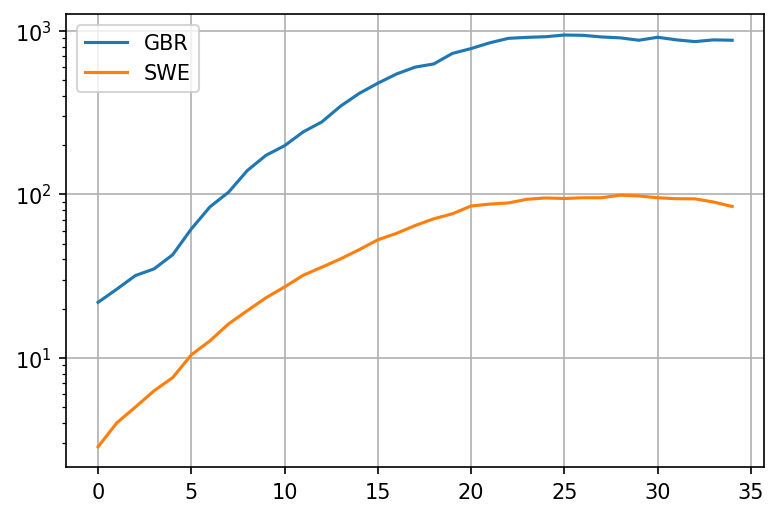

When it comes to COVID-19, Sweden seems to be mentioned as a good model to follow quite often by lockdown skeptics. The evidence they give is that despite not locking down, Sweden did comparably well to many other European countries that did lock down - for example, the UK.

Lets see why this comparison is inadequate as the countries were behaving very differently before any lockdown or mass measures were introduced.

This entire blog post is a valid Jupyther notebook. It uses data that is fully available online. You should be able to copy the entire thing and paste it into Jupyther, run it yourself, tweak any parameters you want. It should make it easier to review the work if you wish to do that, or try and twist the data to prove your own point.

Lets load up both countries stats from ourworldindata:


```python
import pandas as pd
import matplotlib.pyplot as plt
from datetime import datetime, timedelta

plt.rcParams['figure.dpi'] = 150
plt.rcParams['figure.figsize'] = [6.0, 4.0]
dateparse = lambda x: datetime.strptime(x, '%Y-%m-%d')
owid_url = 'https://covid.ourworldindata.org/data/owid-covid-data.csv'
owid = pd.read_csv(owid_url, parse_dates=['date'], date_parser=dateparse)
```

We can get the countries data by their ISO code

```python
codes = ["GBR", "SWE", "ITA", "IRL", "ESP", "FRA"]
```

Now lets compare deaths. We'll start the comparison when both countries deaths per million go above 0.25 per day to match the percentage of succeptable people. We're using the weekly moving average column from ourworldindata in order to get a better sense of the trend. We're going to take 5 weeks of data


```python
countries = {}

populations = { # in million
    "GBR": 66.0,
    "SWE":  10.0,
    "ITA":  60.0,
    "IRL":  5.0,
    "ESP": 47.0,
    "FRA":67.0
}

for name in codes:
    cntr = owid[(owid.iso_code.eq(name)) & (owid.new_deaths_smoothed / populations[name] > 0.25)]
    reindexed = cntr.reset_index()
    countries[name] = reindexed;

def take(name):
    return countries[name].rename(columns={'new_deaths_smoothed': name})[name]


plot = pd.concat([take('GBR'), take('SWE')], axis = 1).iloc[:35].plot(grid=True, logy=True)
```



Okay, so it looks like the deaths in the UK were growing a bit faster than the deaths in Sweden from the very beginning! Lets look at the growth rate with period 5 days. This growth rate should be a crude approximation of $[R_t]$ - its based on the fact that people seem to be most infections around 5 days after contracting the virus. To avoid noisiness when the number of deaths is very low, we'll add $[1 \over 2]$ death per million of population. This should cause $[R_t]$ to drop closer to 1 when deaths per million are fairly low:

```python
def growth(name):
    return (take(name) + populations[name]/2).pct_change(periods=5) + 1

plot = pd.concat([growth('GBR'), growth('SWE')], axis = 1).iloc[:35].plot(grid=True, logy=True)

```


It looks like the rate of growth was higher in the UK during a crucial 10 day period before the middle of March, with a growth factor (analog to $[R_t]$) that is about 30% higher. Now lets try and extrapolate what was going on in terms of cases that produced these deaths.

The mean time from infection to death for patients with fatal outcomes is 21 days. The standard deviation has been estimated to be anywhere between 5 and 7 days. Lets try to keep things simple and stick to 21 days

```python
case_ranges = {}

for name in codes:
    case_ranges[name] = [countries[name].iloc[0]['date']  - timedelta(days=21), countries[name].iloc[0]['date']  + timedelta(days=14)]

print('GBR', case_ranges['GBR'][0], 'to', case_ranges['GBR'][1])
print('SWE', case_ranges['SWE'][0], 'to', case_ranges['SWE'][1])
```

    GBR 2020-02-28 00:00:00 to 2020-04-03 00:00:00
    SWE 2020-02-28 00:00:00 to 2020-04-03 00:00:00

This means that the dates where we observe these rates of growth begin on the 1th of March in both UK and in Sweden. Point 5 in the plot is therefore March 5th.

So what happened between March 5th and March 18th in the UK, where the rate of growth seemed to have been between quite high? And what happened in Sweden?

### UK: Contact tracing

Contact tracing is a reasonably decent strategy. Assuming you have enough capacity, you should be able to find everyone in contact with the infected person, and also their contacts and so on. It should work reasonably well for most viruses, especially those that have mainly symptomatic spread.

Unfortunately SARS-COV-2 seems to have had an asymptomatic component. The virus quickly entered the community spread phase.

PHE gave up on contact tracing due to being overwhelmed on March 11th. That would be somewhere afterpoint 20. Growth rate still very high, above 2.0. No measures were in place at that time.

After an additional week or two of nothing much, UK finally implemented a lockdown on March 23rd


### Sweden: Mass measures

* Feb 27th: Almega, the largest organization of service companies in Sweden advised employees to stay at home if they visited high risk areas
* March 3rd: The Scandinavian airline SAS stopped all flights to northern Italy
* March 11: The government announced that the qualifying day of sickness ('karensdag') will be temporarily abolished in order to ensure that people feeling slightly ill will stay at home from work. This means that the state will pay sick pay allowance from the first day the employee is absent from work


## Mobility trends

But these are all just decrees. Lets see what really happened by looking at google mobility trends

```python
dateparse = lambda x: datetime.strptime(x, '%b %d, %Y')
mobility = pd.read_csv('https://drive.google.com/u/0/uc?id=1M4GY_K4y6KZtkDtz7i12fhs8LeyUTyaK&export=download', parse_dates=['Date'], date_parser=dateparse)
```

```python
def extract_mobility(code, name):
    mob = mobility[mobility.Code.eq(code)]
    colname = code + ' ' + name
    mobranged = mob.loc[(mobility['Date'] >= case_ranges[code][0]) & (mobility['Date'] <= case_ranges[code][1])];
    mobnamed = mobranged.reset_index().rename(columns={''+name: colname})[colname]
    return mobnamed

def plot_item(name):
    plt = pd.concat([extract_mobility('GBR', name), extract_mobility('SWE', name)], axis=1).plot(grid=True)
```


```python
plot_item('Workplaces (%)')
plot_item('Residential (%)')
plot_item('Transit Stations (%)')
```


Really interesting. Looks like already took matters into their own hands in the UK as much as possible starting March 11th. Things really only take off after March 15th though, with the reduction of workplaces.

Lets superimpose the two charts for the UK - the "stay at home" chart and the "growth rate" chart:


```python
plt = pd.concat([extract_mobility('GBR', 'Residential (%)'), growth('GBR').rename('GBR Growth * 10').iloc[:35] * 10], axis=1).plot(grid=True)
```


Say what? Staying at home seems to overlap very well with the 21-day adjusted drop of the growth rate in deaths? Who would've thought.

Note that Sweden reacted to the pandemic a day or two days earlier than the UK did but the difference doesn't seem significant - it could largely be an artifact of us trying to align the moment where the virus was equally wide-spread within the population.

Regardless, its still wrong to compare UK with Sweden when the early pre-measures rates of growth are different. To show why, I will use a car analogy

### The car analogy

Lets say we have two car models from the same company, World Cars. World cars are a bit quirky, they like to name their cars by countries in the world. We would like to decide which one to buy and one of the factors we're interested in is safety. Specifically, we want to know how well the brakes work.

To determine which car is better, we try to look up at some data on braking tests. We find the
following two datapoints for the cars:

| Car name | Brake distance |
|----------|----------------|
| UK       | 32 m           |
| Sweden   | 30 m           |

Oh, nice. It looks like the brakes are pretty similar, with Sweden's being slightly better.

But then you notice something odd about these two tests. It looks like they were performed at
different initial speeds!

| Car name | Brake distance | Initial speed |
|----------|----------------|---------------|
| UK       | 32 m           | 80 km/h       |
| Sweden   | 30 m           | 40 km/h       |

Wait a minute. This comparison makes no sense now! In fact its quite likely that the UK car brakes are way more effective,  being able to stop in just 32m from a starting speed of 80 km/h. A little [back of the napkin](https://www.johannes-strommer.com/diverses/pages-in-english/stopping-distance-acceleration-speed/) math shows that UK's brake distance for an initial speed of 40 km/h would be just 8 meters:

| Car name | Brake distance | Initial speed |
|----------|----------------|---------------|
| UK       | 8 m            | 40 km/h       |
| Sweden   | 30 m           | 40 km/h       |

Now lets look at the rate of growth chart for daily deaths again:


Just as we can't compare the effectiveness of brakes by the distance traveled if the initial speed
is different, we can't compare the effectiveness of measures by the number of cases per million if
the initial rate of growth was different. Different rate of growth means that different brakes are
needed.

> Note: with cases its probably even worse as exponential (and near-exponential) growth is far more
dramatic than the quadratic growth caused by acceleration

